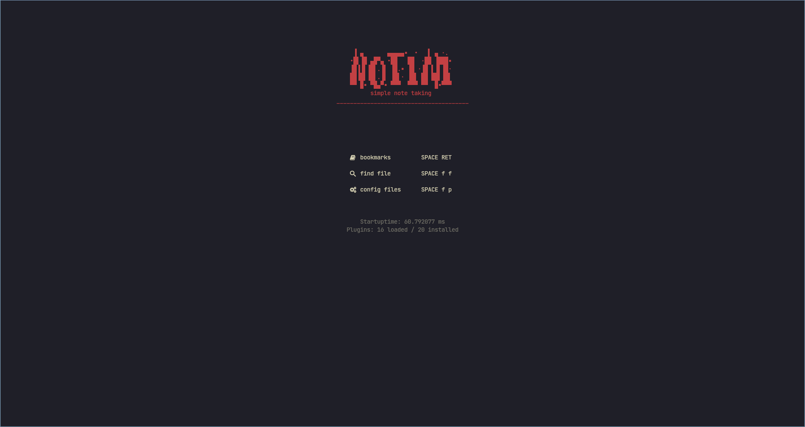
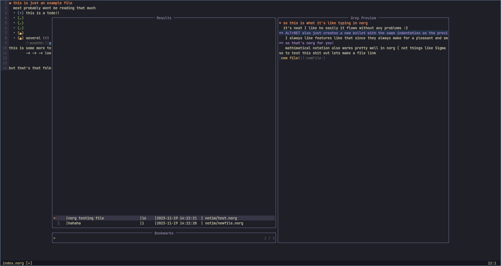
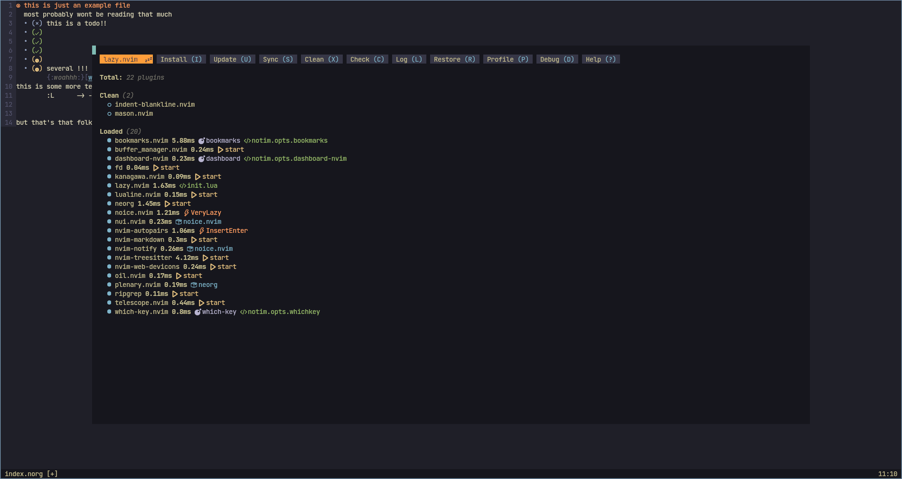

# NOTIM-nvim
## a simple note taking tool
####  Notim is a preconfigured neovim setup specifically designed for note taking



### instalation 
NOTE: Notim has only been tested on **Linux**, so this install may not be aplicable to windows or macOS

Notim isn't reccomended to run replace a neovim config if you activly use neovim for coding,
If this doesn't matter to you you can just clone Notim into your directory
```
$ git clone https://github.com/LunaKITPI/notim-nvim.git ~/.config/nvim/
```
if you want to keep your current neovim config alongside notim
1. clone notim in your config folder as "notim"
```
$ git clone https://github.com/LunaKITPI/notim-nvim.git ~/.config/notim/
```
2. set an alias for neovim using notim, this is different depending on what shell you use

### fish
type the following in your terminal
```
$ alias --save nt="nvim -u ~/.config/notim/init.lua"
```
### bash/zsh
add the following to your .bashrc/.zshrc file
```
$ alias nt='nvim -u ~/.config/notim/init.lua'
```
after you've done this you can open notim by typing "nt" into your cli
### features
- plugins chosen for ease of use
- lightweight
- extensible with your own plugins & configurations

notim is made to comfortably take notes in both markdown and norg [(neorg)](https://github.com/nvim-neorg/neorg) file formats
# who is this made for?
ppl like me who have a pretty underpowered laptop, are student, and/or just love using neovim 
as a note taking tool.
## why was this made?
this was originally a project made so I can run something like emacs org-mode but on my underpowerd laptop.
eventually I experimented with several plugins and ended up with a config I felt really comfortable using.
This repo is just here to share a personal configuration I made.
# Plugin list
sorry if I forget any plugins
show the developers of these plugins support!
   - [bookmarks.nvim](https://github.com/crusj/bookmarks.nvim)
   - [buffer_manager.nvim](https://github.com/j-morano/buffer_manager.nvim)
   - [dashboard.nvim](https://github.com/nvimdev/dashboard-nvim)
   - [telescope](https://github.com/nvim-telescope/telescope.nvim)
   - [kanagawa,nvim](https://github.com/rebelot/kanagawa.nvim)
   - [lazy.nvim](https://github.com/folke/lazy.nvim)
   - [lualine.nvim](https://github.com/nvim-lualine/lualine.nvim)
   - [neorg](https://github.com/nvim-neorg/neorg)
   - [noice.nvim](https://github.com/folke/noice.nvim)
   - [nui.nvim](https://github.com/MunifTanjim/nui.nvim)
   - [nvim-markdown](https://github.com/ixru/nvim-markdown)
   - [nvim-notify](https://github.com/rcarriga/nvim-notify)
   - [nvim-treesitter](https://github.com/nvim-treesitter/nvim-treesitter)
   - [nvim-web-devicons](https://github.com/nvim-tree/nvim-web-devicons)
   - [oil.nvim](https://github.com/stevearc/oil.nvim)
   - [plenary.nvim](https://github.com/nvim-lua/plenary.nvim)
   - [ripgrep](https://github.com/rinx/nvim-ripgrep)
   - [which-key.nvim](https://github.com/folke/which-key.nvim)
   - [nvim-autopairs](https://github.com/windwp/nvim-autopairs)
   - [Markdown-preview](https://github.com/iamcco/markdown-preview.nvim)
# side note
hi everyone, this is my first time making my own neovim config and also my first time making a github repo.
If I did something that isn't rly "the standard" or if you notice I could've done something 
better feel free to tell me via an issue or something like that! All the help is apreciated!
